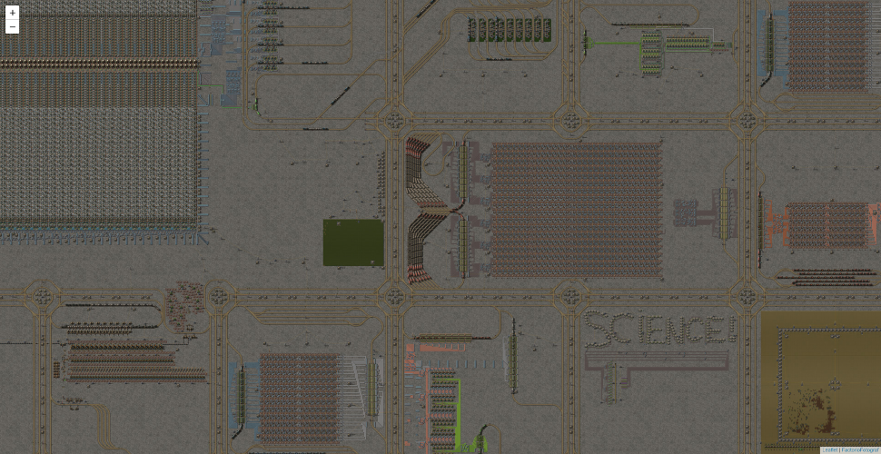

# Factorio Fotograf

Minimalistic and easy to customize Factorio map generator for Linux in 377 lines of code.  

## Examples
- [Protab](https://randacek.dev/m/f/protab/) - Large vanilla map. Less than 4 minutes to generate on 12 thread 2Ghz cpu.
- [Space Exploration map](https://randacek.dev/m/f/se/) - Mod compatible.

## Usage
`./run.sh save-name [--png]`  
[Detailed usage guide](./docs/guide.md)

## Deps
Non-headless Factorio that you can run from terminal by `factorio`, `jq`, `convert` (imagemagick) and `gcc`.  
  
(Arch: `yay -S factorio jq imagemagick gcc --needed`)  

## Features
- [x] Web
- [x] Compatible with other mods
- [x] Zooming in parallel
- [x] Position in the url
- [x] PNG & JPEG export
- [ ] Map time lapse capturing
- [ ] Multiple surfaces
- [ ] Really large maps run out of ram when taking screenshots
- [ ] Achieve optimal C code
  - [ ] Read image bitmap straight into the final position in ram to avoid copying

